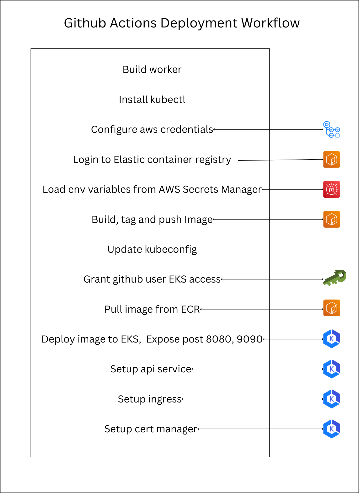

# Transactions API

The Transactions API is a complete end-to-end backend service written in Go, allowing users to create accounts and transfer amounts between accounts. The service supports both HTTP and gRPC calls. The following features are included:

## Table of Contents
- [Features](#features)
- [API Service](#api-service)
- [Cloud Architecture](#cloud-architecture)
- [GitHub Deployment Action](#github-deployment-action)
- [DB Schema](#db-schema)
- [References](#references)
- [Setup](#setup)
  - [Commands](#commands)

## Features

- **Transactions**: The underlying PostgreSQL database operates on a read committed isolation level and implements transactions and rollbacks to handle amount transfer between two accounts.

- **Deadlock Prevention**: Transactions are managed in a way to avoid all possible deadlock situations, even when multiple transactions are being operated on the same account.

- **Authentication**: Implements both JWT and Paseto for authentication middleware.

- **Role-Based Access Control**: Supports multiple roles assigned to users to manage their level of access.

- **Sessions**: Implements access and refresh token functionality.

- **Automated Documentation**: Uses dbdocs and Swagger UI for automated database schema and api documentation.

- **Email Verification**: Includes email verification for account creation.

- **Redis Workers**: Utilizes Redis queues to handle user creation and sending verification emails.

- **Protocol Buffers**: Uses protocol buffers to generate code.

- **gRPC and HTTP Gateway**: Serves gRPC requests and implements an HTTP gateway to also serve HTTP requests.

- **Test Package**: Implements test cases with wide coverage in every package.

- **Graceful Server Shutdown**: Implements graceful server shutdown procedures to ensure all in-progress transactions are completed and resources are properly released during shutdown or restart.

- **Database Migration**: Implements versioning of every change in the database schema and migration scripts to migrate up and down.

- **Docker Compose**: Automates building of images and setting up PostgreSQL and Redis containers to set up a local environment.

- **GitHub Actions**: Uses GitHub Actions to run and validate all test cases on push to the main branch, and to build, push, and deploy images on AWS.

- **CI/CD and full cloud support**: Utilizes GitHub Actions and AWS (VPC, EKS, ECR, RDS, ElastiCache, IAM, Secrets Manager, etc.) to implement smooth integration and deployment.

## API Service

  

The API service evolves from a traditional HTTP-based RESTful architecture in v1 to a more efficient gRPC-based architecture in v2. In v1, the service uses the GIN web framework to handle HTTP requests on port 8080, while v2 introduces an HTTP Gateway to translate HTTP requests into gRPC calls and handles gRPC communication on port 9090. Key components include validation, email handling, background tasks, database interactions, and token management. This architecture supports both HTTP and gRPC clients, enhancing flexibility, scalability, and efficiency.

## Cloud Architecture

The following diagram illustrates the cloud architecture for the Transactions API:

  

### VPC (Virtual Private Cloud)

- **Elastic Kubernetes Service (EKS)**: The main container orchestration service hosting your application.
  - **Kube Proxy**: Manages network routing within the Kubernetes cluster.
  - **Core DNS**: Handles DNS resolution for services within the cluster.
  - **VPC CNI (Container Network Interface)**: Manages network interfaces for pods within the VPC.
  - **Cert Manager**: Manages SSL/TLS certificates, integrating with Let's Encrypt for issuing certificates.
  - **Pods**: 
    - **Pod 1 and Pod 2**: Two instances of your application running on `t3.small` instances. 
  - **API Service**: The application service handling API requests.
    - **Ingress**:
      - **Ingress HTTP (Port 8080)**: Handles HTTP traffic.
      - **Ingress gRPC (Port 9090)**: Handles gRPC traffic.
  - **Ingress Nginx**: Manages incoming traffic and directs it to the appropriate service within the cluster.
  - **Ingress Manager Load Balancer**: Balances the load across different instances of the application.

### External Services

- **AWS RDS (PostgreSQL)**: A managed relational database service (`t3.micro` instance) for storing transactional data.
- **AWS ElastiCache (Redis)**: A managed caching service for improving performance and handling session data.

### Security and Routing

- **Let's Encrypt**: Provides SSL/TLS certificates for secure communication.
- **Route 53**: AWS’s DNS service that routes traffic to the correct endpoints within the VPC.

### Client Communication

- **Client**: Interacts with the API service through HTTP, HTTPS, or gRPC protocols routed via Route 53 to the Ingress Nginx load balancer, which then directs traffic to the appropriate service within the Kubernetes cluster.

This architecture provides a scalable and secure environment for your application, leveraging Kubernetes for container orchestration, AWS RDS for database management, and ElastiCache for caching. The use of Let's Encrypt and Cert Manager ensures secure communication, while Route 53 handles DNS resolution and routing.

## Github Deployment Action

  

The GitHub Actions Deployment Workflow automates the deployment process of the Transactions API using several steps. First, it starts by building the worker and installing kubectl, a command-line tool for interacting with Kubernetes clusters. It then configures AWS credentials to enable access to AWS services and logs into the Elastic Container Registry (ECR) to manage container images. Environment variables are securely loaded from AWS Secrets Manager to ensure sensitive information is not exposed.

Next, the workflow builds the Docker image, tags it appropriately, and pushes it to ECR. It updates the kubeconfig file to configure access to the EKS cluster and grants the GitHub user necessary permissions to interact with the EKS cluster. The workflow then pulls the container image from ECR and deploys it to the EKS cluster, exposing the API service on ports 8080 for HTTP and 9090 for gRPC traffic.

Additionally, it sets up the API service within the cluster, configures the ingress to manage incoming traffic, and sets up the cert manager to handle SSL/TLS certificates, ensuring secure communication. This automated process ensures a smooth and consistent deployment of the application, leveraging the capabilities of GitHub Actions and various AWS services.

## DB schema

  

## References

- gRPC-Gateway: gRPC to JSON proxy generator following the gRPC HTTP spec
- dbdocs: Create web-based database documentation using DSL code.
- swagger ui: Visualize and interact with the API’s resources
- Stephen Griender, techscool: Golang developer guide, advance master class
- kubernetes documentation: for automating software deployment and deployment, service, ingress setup scripts 
- Github actions: For setup of test and deplyment actions

## Setup

Tools required: golang, docker, homebrew/scoop,, migrate, make, dbdocs, sqlc, protoc, gomock, evans, statik, aws-cli, kubectl, k9s

### Commands
- `make postgres`       Spin up a PostgreSQL instance
- `make createdb`       Create the database
- `make migrateup`      Run migrations
- `make redis`          Spin up Redis
- `make server`         Run the server

### Alternatively
- `docker compose up`
